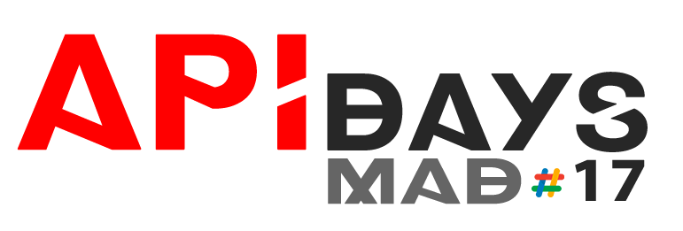

# API Days Madrid # 17

# [](https://github.com/apiaddicts/apidaysmad17)

### About

Project is built on top of [Jekyll](http://jekyllrb.com/) - simple, blog-aware, static site generator. Jekyll also happens to be the engine behind GitHub Pages, which means you can use Jekyll to host your website from GitHub’s servers for free. [Learn more about Jekyll](http://jekyllrb.com/).

### Live demo 
[https://apiaddicts.github.io/apidaysmad17/](https://apiaddicts.github.io/apidaysmad17/)

### Contributions welcome
1. Clone locally `devevlop` branch
2. Update the repo 
3. Create a pull request and assign it to me, Jorge Baumann (@baumannzone)

## Local development

Check if you have [all requirements for local environment](http://jekyllrb.com/docs/installation/).
To install all development dependencies install [Bundler](http://bundler.io/).
```bash
    gem install bundler
```
and run next command from root folder:

```bash
  bundle install
```  

To start Jekyll run:
```bash
    jekyll serve -w
```
Site will be available at http://127.0.0.1:4000/apidaysmad17/ or http://localhost:4000/zeppelin/ (on Windows)

**NOTE:** in this mode all changes to html and data files will be automatically regenerated, but after changing ```_config.yml``` you have to restart server.

### Sass(Compass) support
**Note:** You need to install [Node.js](http://nodejs.org/download/)

To watch changes of `.sass` files and compile it to the `.css` on a fly change property `safe: true` to `safe: false` in `_config.yml`.
**Note: It works only on local machine, because GitHub runs Jekyll in `--save` [mode](https://help.github.com/articles/using-jekyll-with-pages/#configuration-overrides)**

Learn more about Sass development from [documentation](https://github.com/gdg-x/zeppelin/wiki/Sass-development).


### Resource optimizations (optional)

You can optimize images and minify css and javascript automatically (for now only on Windows).
But for Mac OS users available amazing tool - [imageoptim](https://imageoptim.com/). Thanks [@raphaelsavina](https://github.com/raphaelsavina) for link.
Optimize all images by running this script from `/automation/images/` folder:
```bash
    all_image_optimization.bat -d -jtran -pout -pquant -optip -gsicle -svgo
```

To minify CSS and JS run `minify_js.bat` (for Windows) and `minify_js.sh` (for Linux and MacOS) from `/automation/minifying/` folder:
```bash
    minify_js.bat
```

Learn more about available optimization options from [documentation](https://github.com/gdg-x/zeppelin/wiki/Resources-optimizations).

### Documentation
Quick-start guide is not enough? Checkout [full documentation](https://github.com/gdg-x/zeppelin/wiki).

### Used libraries
* [Bootstrap](https://github.com/twbs/bootstrap)
* [Animate.css](https://github.com/daneden/animate.css)
* [Waves](https://github.com/publicis-indonesia/Waves)
* [jquery.appear](https://github.com/bas2k/jquery.appear)
* [jQuery countTo Plugin](https://github.com/mhuggins/jquery-countTo)
* [Typed.js](https://github.com/mattboldt/typed.js)
* [Sticky-kit](https://github.com/leafo/sticky-kit)


### Contributors

See [list of contributors](https://github.com/apiaddicts/apidaysmad17/graphs/contributors?from=2017-08-10)

Maintainers: [@baumannzone](https://github.com/baumannzone)


### License
Project is published under the [MIT license](https://github.com/gdg-x/zeppelin/blob/master/LICENSE.txt). 
Feel free to clone and modify repo as you want, but don't forget to add reference to authors :)
